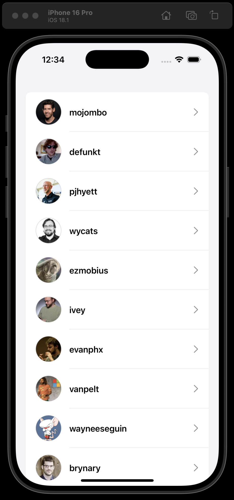
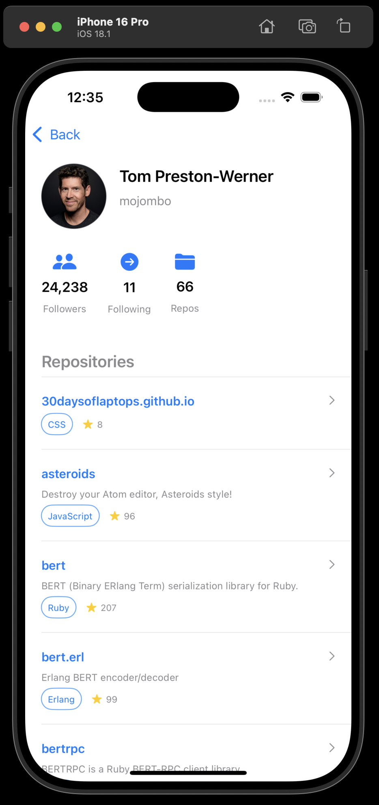
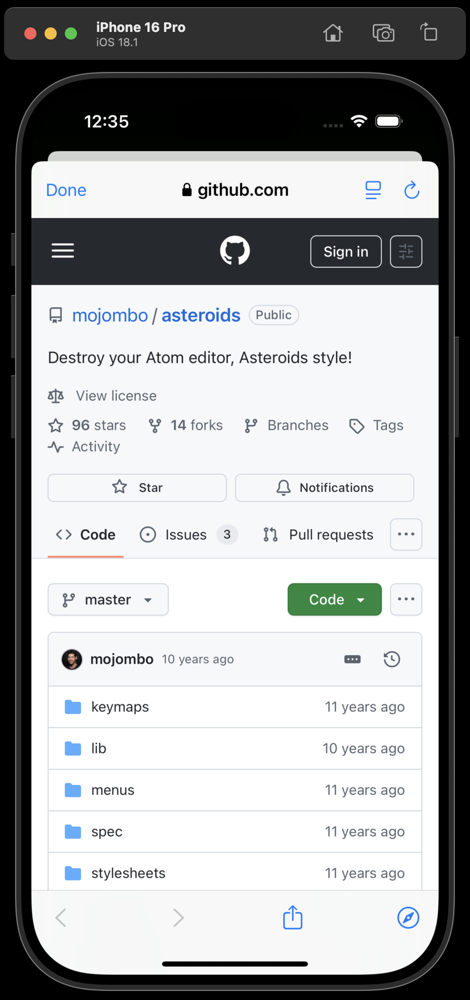
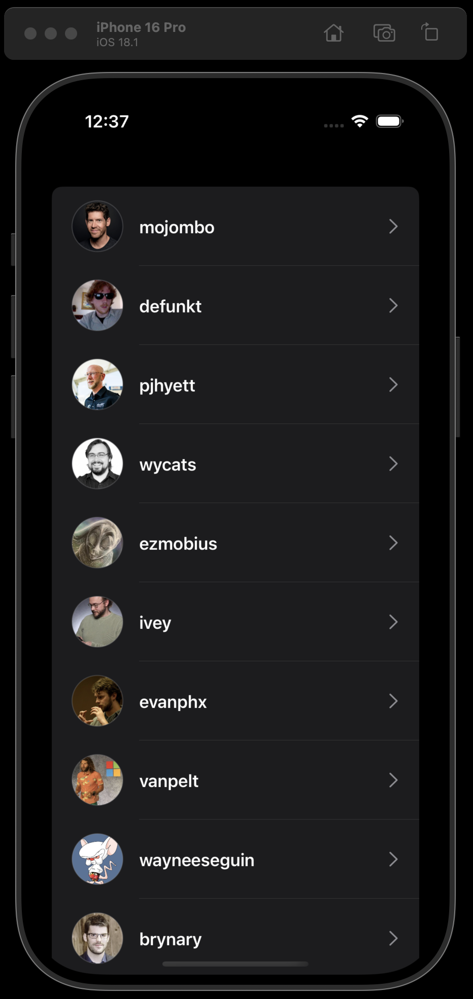
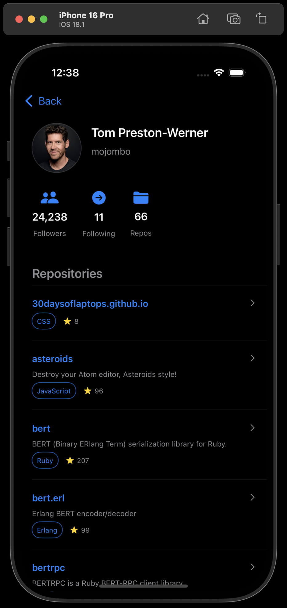
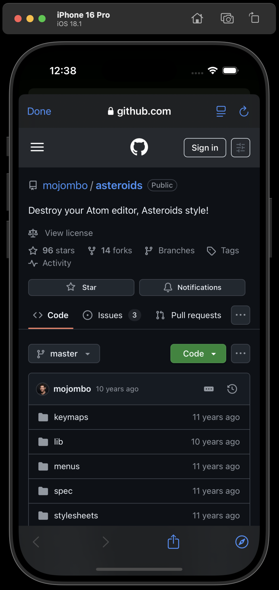

# GitHub Users

A SwiftUI iOS app for exploring GitHub users and their repositories. Built with modern Apple technologies and best practices for async data loading and UI responsiveness.

---

### 🌞 Light Mode

| | | |
|---|---|---|
|  |  |  |

---

### 🌙 Dark Mode

| | | |
|---|---|---|
|  |  |  |

---

## 🛠 Technologies Used

- **Xcode 16.4**
- **SwiftUI**
- **Alamofire** – for handling HTTP networking
- **Combine** – for reactive data flow
- **SDWebImageSwiftUI** – for efficient image loading and caching
- **Swift Concurrency + Combine** – used together for reactive flow and async bindings in SwiftUI  

---

## 🧩 Compatibility Notes

This project uses Swift Concurrency features including `Sendable` protocol conformance.

- Swift Concurrency is available since **Xcode 13 (Swift 5.5)**
- `Sendable` support and strict enforcement is more mature and stable in **Xcode 16**
- Using older Xcode versions (13 or 14) may require manual `@unchecked Sendable` and can have limited concurrency safety checks

---

## 🚀 Features

- 🔍 Browse GitHub **users** with avatar, login, and ID
- 👤 View **user details**, including their public repositories
- 🌐 Open **repositories** directly in a WebView
- 🔄 Implements **GitHub paging**:
  - Different paging strategies for **users** (based on `since`) and **repositories** (pagination)
- ♻️ Smooth **continuous loading** (infinite scroll) for both:
  - User list screen
  - User detail screen with repositories

---

## ⚠️ Simulator Issue (Known Limitation)

While running Unit tests, I encountered an issue on the **iPhone 16 simulator**. I would suggest to change to other simulators. In my case, it worked with **iPhone 16 Pro simulator**.

